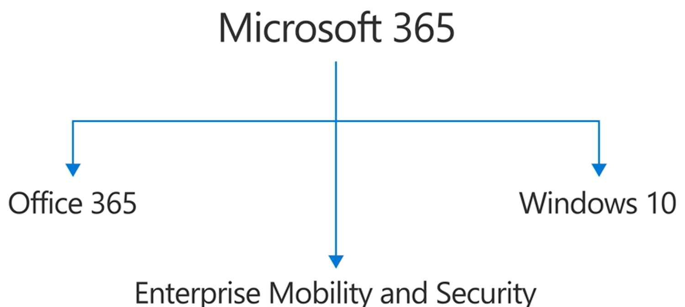

# What is Microsoft 365?

## What is Microsoft 365?

Microsoft 365 is a **productivity** cloud solution built for businesses and organisations to use to deliver **enhance productivity** and **workflow** for its users. It seems to be mainly targeted as a business package solution, consisting of different **software and tools** that will help businesses do their job and collaborate more effectively.

Especially with **modern workplaces** now having a more diverse work culture and landscape; where **teams are more diverse and also globally distributed**. This is signicant for larger companies, with teams in Australia often working together on projects with teams in the head office, typically based in America.

As such, there exists a need for a solution that delivers a **productivity experience** to cover all the different requirements teams may have. Microsoft seems to have done so providing a plethora of business utility power including such software such as:

* Microsoft Teams
* Microsoft Office \(Excel, PowerPoint, Outlook\)
* Microsoft Windows

With Microsoft 365, Microsoft is tackling the **"needs of the modern workplace"** that pretty much all businesses face on a day to day. For Microsoft 365, they look to tackle 3 core areas being:

1. **Productivity and Teamwork**
2. **Business Management**
3. **Security and Compliance**

So for each of these areas, they support different tools to satisfy those different areas.

| Productivity & Teamwork | Business Management | Security & Compliance |
| :--- | :--- | :--- |
| Microsoft Teams | Endpoint Manager \(IT\) | IDM \(Identity/Access\) |
| Microsoft Outlook | Business process automation | Information protection |
| Microsoft Office Apps | Microsoft Teams extensions | Threat protection |
| OneDrive | Power Platform extensions | Security management |
| Intranet & Team Sites | Business/VOIP with Teams | Insider risk management |
| Yammer \(Social Network\) | Forms management | Compliance management |
|  | Workplace analytics | eDiscovery |
|  | Work management \(Project Online\) |  |


Some of these solutions \(like Office\) are different under the **SaaS \(Software-as-a-Service\) model** which is hosted and managed centrally by a **cloud service provider \(CSP\)**. This is delivered to customers through a **monthy/annual subscription** \(like Netflix\)**.**


## Productivity Benefits of Microsoft 365

So Microsoft 365 essentially utilises the Cloud to deliver services and apps that Microsoft builds for customers and businesses to **be more productive so they can ACHIEVE MORE**. By providing these tools, both individuals and organisations are able to do more and realise their full potential.

### Personal Productivity \(for individuals\)

### Organisational Productivity \(how does this benefit organisations?\)

## Subscription Options

