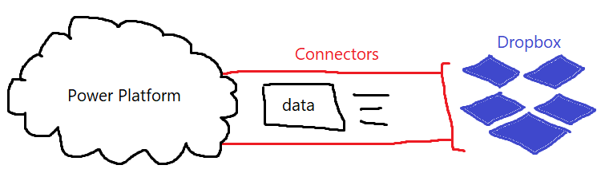

# Features of the Power Platform

## AI Builder

AI Builder is the feature that **lets users of the platform to add AI capabilities in workflows** \(Power Automate\) and apps that they create \(Power Apps\). Again, AI Builder is a **simple no-code solution** for integrating **intelligence into your apps or workflows** which can be useful for doing things such as **predicting business outcomes**, analysing meaningful data and more!

## Common Data Service

CSD \(Common Data Service\) is a **scalable data service** that allows users to **easily store and manage data from multiple data sources**. In essence, the Common Data Service is an **shared area that pools data** from its connected sources. All this is built upon a **Common Data Model** which ensures there is a level of consistency when integrating the data into business applications**.** In essence, the **Common Data Service is the common language or currency that allows the different components of the Power Platform to work together**. The linking of the different Power Platform products is connected by the Common Data Service at the heart, as all the information they require are extracted from the CSD.

## Connectors

Connectors enable users to **connect different apps and data within the cloud**. Connectors act just like in reality; for example cables act as the **physical connection point that bridges the gap between different devices**. Here connectors in the Power Platform exists as the bridge where **information and commands travel across**.

For the Power Platform, there are **over 275 connectors**; connecting both internal and external services; from Power Apps to Salesforce, Dropbox, etc.

## Power Virtual Agents

As covered before, Power Virtual Agents is part of the circle of Power Platform products, so **integrating chatbots made using Power Virtual Agents into other systems is streamlined with Power Automate simply out-of-the-box!** \(e.g. command chatbots to do something inside of your app by calling a **Power Automate Flow**.

